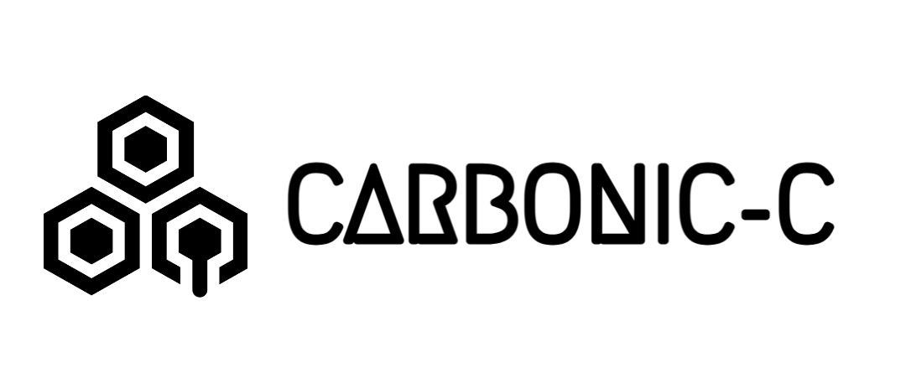

<!-- Improved compatibility of back to top link: See: https://github.com/othneildrew/Best-README-Template/pull/73 -->
<a name="readme-top"></a>
<!--
*** Thanks for checking out the Best-README-Template. If you have a suggestion
*** that would make this better, please fork the repo and create a pull request
*** or simply open an issue with the tag "enhancement".
*** Don't forget to give the project a star!
*** Thanks again! Now go create something AMAZING! :D
-->


<!-- PROJECT SHIELDS -->
<!--
*** I'm using markdown "reference style" links for readability.
*** Reference links are enclosed in brackets [ ] instead of parentheses ( ).
*** See the bottom of this document for the declaration of the reference variables
*** for contributors-url, forks-url, etc. This is an optional, concise syntax you may use.
*** https://www.markdownguide.org/basic-syntax/#reference-style-links
-->
[![Contributors][contributors-shield]][contributors-url]
[![Forks][forks-shield]][forks-url]
[![Stargazers][stars-shield]][stars-url]
[![Issues][issues-shield]][issues-url]
[![BSD License][license-shield]][license-url]


<!-- PROJECT LOGO -->
<br />
<div align="center">
  <a href="https://github.com/IVIosab/carbonic-c">
    
  </a>

<h3 align="center">Carbonic-C</h3>

  <p align="center">
    Lightweight Pascal/Oberon-like imperative programming language
    <br />
    <a href="https://github.com/IVIosab/carbonic-c"><strong>Explore the docs »</strong></a>

  </p>
</div>


<!-- TABLE OF CONTENTS -->
<details>
  <summary>Table of Contents</summary>
  <ol>
    <li>
      <a href="#about-the-project">About The Project</a>
      <ul>
        <li><a href="#built-with">Built With</a></li>
      </ul>
    </li>
    <li>
      <a href="#getting-started">Getting Started</a>
      <ul>
        <li><a href="#prerequisites">Prerequisites</a></li>
        <li><a href="#installation">Installation</a></li>
      </ul>
    </li>
    <li><a href="#usage">Usage</a></li>
    <li><a href="#roadmap">Roadmap</a></li>
    <li><a href="#contributing">Contributing</a></li>
    <li><a href="#license">License</a></li>
    <li><a href="#contact">Contact</a></li>
    <li><a href="#acknowledgments">Acknowledgments</a></li>
  </ol>
</details>


<!-- ABOUT THE PROJECT -->
## About The Project




<p align="right">(<a href="#readme-top">back to top</a>)</p>

Carbonic-C is a lightweight imperative programming language with Pascal/Oberon-like syntax. The language supports a set of basic features you would find in any programming language, as well as some more complex ones.
Below are some of the main characteristics of the language:

* The langugae is static. Object types are fixed at object declarations and cannot change during program execution.
* There are three predefined data types: integer, real, boolean.
* There are two predefined data structures: structs, arrays.
* Full expression syntax with usual set of operators.
* The language is compiled, `LLVM` bytecode being the target.
* The structure of the program is a sequence of data and routine declarations.
* The language features a standard set of statements: Assignment, if/while, return, output.


### Built With

* [![CPP][CPlusPlus]][CPlusPlus-Link]
* [![CMake][CMake]][CMake-Link]
* [![LLVM][LLVM]][LLVM-Link]
* [![Bison][Bison]][Bison-Link]
* [![Flex][Flex]][Flex-Link]

<p align="right">(<a href="#readme-top">back to top</a>)</p>


<!-- GETTING STARTED -->
## Getting Started

Below are the instructions for setting up the project locally on a Linux machine.
### Prerequisites

* g++ 11.3.0
  ```sh
  sudo apt install g++=11.3.0
  ```

* flex 2.6.4
  ```sh
  sudo apt install flex=2.6.4
  ```

* bison 3.8.2
  ```sh
  sudo apt install bison=3.8.2
  ```

* make 4.3
  ```sh
  sudo apt install make=4.3
  ```

* cmake 3.26.0
  ```sh
  sudo apt install cmake=2.6.4
  ```

<!-- USAGE EXAMPLES -->
## Usage

The project uses `CMake` as a build tool and contains a `Makefile` to provide an interface to easily use it. Below is the list of commands and their corresponding functionalities. These commands are available directly in the source directory.

* `run` : Runs the compiler in the terminal and expects input from `stdin`. Prints output to `stdout`. This can be used as the "default' command for running the compiler, and is the quickest way to do so.

```sh
  make run
  ```
* `run/file` : Compiles the contents of the `input.crbc` file in the source directory and produces output to `output.out` also in the source directory.

```sh
  make run/file
  ```
* `test` : Runs a large set of valid/invalid Unit and End-to-End tests that test the entire compiler as well as its individual components and features. The test suite is run using `CTest` and prints elaborate output and test stats to the terminal.

```sh
  make test
  ```

* `build` : If not previously built, this command will build the compiler in all of its stages and produce a single executable file. All generated files can be found in `carbonic-c/build`. If previously built, this command will build partially (re-compiling only files that have been touched since last built). This should be used as the default command for building the project after any changes are made.

```sh
  make build
  ```

* `clean` : Removes all previously generated build and output files. This command can be used to restore the project to its "default" state

```sh
  make clean
  ```

* `build/all` : Runs `clean`, removing all previously generated files and resetting the project, after that it builds the project from scratch with all of its components.

```sh
  make build/all
  ```


<p align="right">(<a href="#readme-top">back to top</a>)</p>


<!-- ROADMAP -->
## Roadmap

- [ ] Feature 1
- [ ] Feature 2
- [ ] Feature 3
    - [ ] Nested Feature

See the [open issues](https://github.com/IVIosab/carbonic-c/issues) for a full list of proposed features (and known issues).

<p align="right">(<a href="#readme-top">back to top</a>)</p>


<!-- CONTRIBUTING -->
## Contributing

Contributions are what make the open source community such an amazing place to learn, inspire, and create. Any contributions you make are **greatly appreciated**.

If you have a suggestion that would make this better, please fork the repo and create a pull request. You can also simply open an issue with the tag "enhancement".
Don't forget to give the project a star! Thanks again!

1. Fork the Project
2. Create your Feature Branch (`git checkout -b feature/AmazingFeature`)
3. Commit your Changes (`git commit -m 'Add some AmazingFeature'`)
4. Push to the Branch (`git push origin feature/AmazingFeature`)
5. Open a Pull Request

<p align="right">(<a href="#readme-top">back to top</a>)</p>


<!-- LICENSE -->
## License

Distributed under the MIT License. See `LICENSE.txt` for more information.

<p align="right">(<a href="#readme-top">back to top</a>)</p>


<!-- CONTACT -->
## Contact

Your Name - [@twitter_handle](https://twitter.com/twitter_handle) - email@email_client.com

Project Link: [https://github.com/IVIosab/carbonic-c](https://github.com/IVIosab/carbonic-c)

<p align="right">(<a href="#readme-top">back to top</a>)</p>


<!-- ACKNOWLEDGMENTS -->
## Acknowledgments

* []()
* []()
* []()

<p align="right">(<a href="#readme-top">back to top</a>)</p>


<!-- MARKDOWN LINKS & IMAGES -->
<!-- https://www.markdownguide.org/basic-syntax/#reference-style-links -->
[contributors-shield]: https://img.shields.io/github/contributors/IVIosab/carbonic-c.svg?style=for-the-badge
[contributors-url]: https://github.com/IVIosab/carbonic-c/graphs/contributors
[forks-shield]: https://img.shields.io/github/forks/IVIosab/carbonic-c.svg?style=for-the-badge
[forks-url]: https://github.com/IVIosab/carbonic-c/network/members
[stars-shield]: https://img.shields.io/github/stars/IVIosab/carbonic-c.svg?style=for-the-badge
[stars-url]: https://github.com/IVIosab/carbonic-c/stargazers
[issues-shield]: https://img.shields.io/github/issues/IVIosab/carbonic-c.svg?style=for-the-badge
[issues-url]: https://github.com/IVIosab/carbonic-c/issues
[license-shield]: https://img.shields.io/github/license/IVIosab/carbonic-c.svg?style=for-the-badge
[license-url]: https://github.com/IVIosab/carbonic-c/blob/master/LICENSE.txt
[linkedin-shield]: https://img.shields.io/badge/-LinkedIn-black.svg?style=for-the-badge&logo=linkedin&colorB=555
[linkedin-url]: https://linkedin.com/in/linkedin_username
[CPlusPlus]: https://img.shields.io/badge/C++-004C99?style=for-the-badge&logo=cplusplus&logoColor=white
[CMake]: https://img.shields.io/badge/CMake-FFFFFF?style=for-the-badge&logo=cmake&logoColor=red
[LLVM]: https://img.shields.io/badge/LLVM-000000?style=for-the-badge&logo=llvm&logoColor=red
[Flex]: https://img.shields.io/badge/Flex-FF7D32?style=for-the-badge&logo=flex&logoColor=red
[Bison]: https://img.shields.io/badge/Bison-FF0000?style=for-the-badge&logo=gnu&logoColor=white
[Bison-Link]: https://www.gnu.org/software/bison/manual/
[CPlusPlus-Link]: https://en.cppreference.com/w/
[CMake-Link]: https://cmake.org/
[LLVM-Link]: https://llvm.org/
[Flex-Link]: https://en.wikipedia.org/wiki/Flex_(lexical_analyser_generator)